# OVERALL PRODUCT VERDICT

Product/UX audit of https://kinetable.vercel.app, conducted 27 September 2026 before Slice 11. Recommendations are proposals, not implemented behavior.

**Kinetable has a functioning core, but the current experience is not ready for another layer of features. Complete a UX correction pass before Slice 11.**

The product currently feels like operating a web application around a hardware viewport. There are moments of direct hardware manipulation, but forms, lists, scrolling, modes and configuration dominate the journey. The landing page is substantially more coherent than the application.

This is not merely a color or spacing problem. The core problems are project retrieval, an unclear first success, unreadable spatial assembly, fragmented mode transitions and insufficient teaching.

| Area | Score /10 | Reason |
|---|---:|---|
| First-time usability | 3 | Attractive entry; no clear, accessible route to a working first build |
| Returning-user usability | 2 | Restore works, but entry repeats setup and previous projects cannot be selected |
| Visual hierarchy | 4 | Hardware, headings, modes, forms and lists compete |
| Spatial workbench | 4 | Manipulation exists; assembly, framing and occlusion undermine comprehension |
| Wiring UX | 3 | Validated connections work; novice guidance and endpoint selection are weak |
| Visual Logic | 4 | Useful semantic model buried in a dense technical form |
| Simulation | 6 | BONK behavior works; controls, state continuity and visibility need correction |
| Explain | 3 | Causal truth exists, but presentation reads like a trace rather than a lesson |
| Navigation | 2 | Table conflates home/editor; no project chooser; public/app entry inconsistent |
| Visual identity | 6 | Strong landing and warm palette; application lacks consistent tactile refinement |
| Mobile/responsive | 3 | Some adapted controls; much of the experience is desktop content stacked |
| Overall product readiness | 4 | Credible functional foundation; insufficient clarity for independent beginners |

These are expert-review judgments, not measured student success rates.

## Evidence and limits

Evaluation used the deployed product before reading any repository source. It began with an empty, unsigned-in guest state, then used the supplied account. The browser tooling did not certify incognito/profile isolation, so the strict fresh-incognito requirement is not fully verified.

Tested: onboarding; project creation; parts and breadboard; direct and form-based wiring attempts; orbit, zoom, focus, reset and attempted pan; inspectors; remove/replace guards; undo/redo; BONK with 12 saved connections; Visual Logic; simulation; Explain/X-Ray; account; reload; second-project creation; DHT11 environment input; responsive desktop/tablet/mobile widths; and intentional mistakes.

BONK ×2 worked. Changing to ×3 produced the changed saved behavior and “applied BEEP ×3” causal event. LED state and OLED output text were verified in the UI. Audible buzzer output, real hardware execution, independent cloud restore, live AI inference, real touch gestures and a complete breadboard lead-placement workflow were not verified. Pan was exercised, but its visual result was less conclusive than orbit/zoom. No crash or data loss was observed; captured warning/error console logs were empty.

Primary black-box findings were frozen before source review. One supplemental unsupported-topology check followed source mapping: a resistor wired between GPIO19 and ground produced “Circuit ready” alongside disabled simulation and “220 Ω resistor has no supported simulation topology yet.” That deliberate fixture was undone.

Remote main was verified as **d4c925662027c459e9999d9984ee57f8d5350bfe**, matching the requested SHA. At audit time, local HEAD was **08c2e8480ca458e234706d02c43202d7a4fa4d13**. Source review used Git objects from verified main, without checking out or changing files. The deployment itself does not expose proof of its exact commit in the UI.

## Actual journey: what would a first-time user do next?

| Step | Experience and expected next action | Health |
|---|---|---|
| 1. Landing | I infer a visual electronics building/learning tool. I expect an idea to become an interactive build. “Something real” leaves physical execution ambiguous. | Good promise; limits unclear |
| 2. Open Kinetable | I expect an app launch or short guided introduction. I receive board setup. | Understandable first run |
| 3. Select board | ESP32/Pico/Uno are recognizable. “Board you already have” suggests ownership is required. No “not sure” or explicit virtual option. | Partial |
| 4. First Table | “Table” seems to mean the editor/work surface. The saved “Project” is also named “First table.” I cannot reliably separate them. New Build, Add part and four modes all suggest competing next actions. | Poor |
| 5. Create/build | Describing the idea is approachable. Create build saves the idea and board; a separate AI action then requires providers. “Show me first” previews the starting point, not a working example. | Poor handoff |
| 6. Add parts | Tray is contextual, which is good. Technical names and generic glyphs give little help choosing a function. Adding a part removes the AI assembly entry. | Partial |
| 7. Wire | Connections can be created and saved. Pin/hole targeting is difficult at the current scene scale; fallback selectors expose hundreds of endpoints. The next required connection is not explained. | Poor for beginners |
| 8. Logic | BONK starter appears after the matching circuit is complete. Rules work, but IDs, order buttons, delete controls and timings dominate. | Functional; overwhelming |
| 9. Simulate | Play and Press button produce the expected BONK state. Controls sit below the viewport; rendered OLED is partly occluded, so textual output does much of the communication. | Functional; fragmented |
| 10. Explain/X-Ray | Modes and trace are real. Supply paths expose UUIDs and the causal story is technical rather than instructional. | Weak teaching |
| 11. Return/reload | Saved circuit and logic restore. Opening from the landing repeats board setup. Creating another project leaves no visible way back to BONK. | Serious retrieval gap |
| 12. Mistakes | Atomic rejection and undo are valuable. Errors often name constraints without directing the repair. | Mixed |
| 13. Responsive use | Phone/tablet require substantial scrolling between hardware and task controls; selecting an item below can open an inspector above. | Poor task adaptation |
| 14. Account/settings | Sign-in succeeds; sync status is visible. Menu looks like a lightly styled document block. AI settings begin with bridge/terminal instructions. | Functional; inconsistent |

# TOP 10 PROBLEMS

**P0 = blocks a core user task; P1 = fix before feature expansion; P2 = important refinement; P3 = can wait.** P0 here is a product-access problem, not a claim of data loss or a security defect.

## 1. P0 — Saved projects have no usable retrieval path

**Problem:** There is a current project, but no visible project chooser.

**Evidence:** I created and saved BONK, then a second audit project. The second opened successfully; no list/switcher/reopen action appeared in navigation or the full page. Reload chose the current/latest project. Source confirms local/cloud lists exist and the store selects the newest eligible row.

**Why it matters:** Users cannot safely understand where their earlier work went. Independent projects are not meaningfully usable without retrieval.

**Recommended change:** Bring a minimal Projects list and open-by-ID action forward. Put the current project name and a switcher in the workbench header. Keep versioning, Explore and collaboration deferred.

## 2. P1 — The promised first success requires hidden expertise

**Problem:** The idea-first promise ends at an empty project unless the user knows manual electronics or AI setup.

**Evidence:** Create build saved intent and board. Build with Kinetable requested a local model, CLI or API provider. Provider settings led with checkout/terminal/bridge instructions. “Show me first” needed an idea and said no parts/connections were planned. BONK starter only appeared after I assembled its complete circuit.

**Why it matters:** A normal student cannot reach the intended first success independently.

**Recommended change:** Offer a genuinely validated “Try BONK” starter before blank authoring, available without a provider. Keep “New project” as the other path. Explain AI requirements before requesting AI assembly. Use “Preview starting point” if that is all the current preview does.

## 3. P1 — The scene does not form a readable physical assembly

**Problem:** Parts overlap and wires cross without a clear layout.

**Evidence:** In my manually assembled BONK, the OLED was partly covered by the breadboard, the LED appeared over holes without an evident seated assembly, and multiple wires crossed the diagonal ESP32. This matches the user's attached image. Changing to the narrower Logic view worsened framing.

**Why it matters:** A spatial hardware tool must make the physical relationships easier to understand than a pin table.

**Recommended change:** Use footprint-aware placement for the small current catalog; add Fit project; keep new parts clear of existing hardware; offer explicit Arrange rather than moving user work silently. Make wire arcs/routing readable and raise selected paths. Improve contact shadows, component proportions and breadboard lead-placement cues. Preserve electrical endpoints as truth.

## 4. P1 — Wiring works as an operation, not a learning interaction

**Problem:** The user has to know the target relationship in advance.

**Evidence:** I relied on From/To controls to build the 12-wire circuit. A breadboard adds 400 hole options to a flat endpoint list. A direct LED supply connection remained incomplete without an immediately actionable explanation. A buzzer VIN attempt was rejected with a useful voltage requirement, but no repair action.

**Why it matters:** Students need to discover compatible connections and understand breadboard strips, current limiting and ground.

**Recommended change:** Wire mode should show one source, compatible target groups and one next instruction. Keep a keyboard-accessible connection dialog, grouped by component → pin, or breadboard → row/hole. Show connected breadboard strips. Link diagnostics to the relevant object and a repair action.

## 5. P1 — Too much chrome stays visible after its purpose is over

**Problem:** Project identity, hardware editing, camera help, parts, connections and runtime details are spread across the page.

**Evidence:** Parts and every saved wire remained visible in Logic, Simulate and Explain. Project name/save status were at the bottom. Desktop Logic had an independently scrolling form; page scroll and canvas zoom competed. Selection from a lower list opened the inspector in the distant viewport.

**Why it matters:** The user spends attention managing the interface and loses the relationship between action and hardware.

**Recommended change:** Move project identity/save status to a compact header. Keep modes, one task toolbar, Fit and selected-object context visible. Put Parts/Connections in an accessible contextual drawer. Replace permanent gesture instructions with first-use hints and a Help control.

## 6. P1 — Visual Logic exposes implementation structure

**Problem:** The human-readable model is diluted by a form showing every edit control.

**Evidence:** BONK showed rule IDs, full component UUIDs, repeated component selectors, IF Always, per-rule/per-action ordering and deletion, plus millisecond timing. Entering zero beep count reverted the edit and showed “Invalid project command.” Undo labeled as a logic edit shares history with hardware edits.

**Why it matters:** Editing “beep twice” should be easy without understanding a behavior IR or transaction boundary.

**Recommended change:** Default to concise sentences anchored to hardware: “When Button is pressed → OLED shows BONK! → LED turns on → Buzzer beeps 2 times.” Expand only the selected action. Hide IDs, timing and ordering under details. Validate fields locally and commit complete edits. Show the actual next undo action across modes.

## 7. P1 — Simulation controls and session state are disconnected from the scene

**Problem:** Entering simulation does not clearly communicate how to try the hardware or preserve the previous run.

**Evidence:** BONK reacted through the external Press/Release control. The OLED output was legible in a text row, while the actual screen was obscured. Explain preserved the previous trace, but returning to Simulate reset to Paused/0 ms/READY. The supplemental test showed “Circuit ready” while simulation was unsupported.

**Why it matters:** Unexpected resets and mixed readiness signals break the experiment/inspect/change loop.

**Recommended change:** Put Run/Pause/Reset in a compact toolbar next to the canvas. Highlight the usable button on entry; retain accessible DOM input controls. Preserve a valid paused session between Simulate and Explain until explicit Reset or a circuit/logic change. Separate “Connections complete” from “Simulation supported.”

Source mapping found direct on-object button toggling already exists. The correction is discoverability and physical feedback, not a claim that this capability is absent.

## 8. P1 — Explain exposes evidence but does not teach the cause

**Problem:** Raw topology and runtime detail lead the explanation.

**Evidence:** Power paths used board-main/part UUID chains. BONK trace referred to rule-bonk-press, GPIO LOW and applied BEEP ×2. X-Ray categories worked, but unrelated geometry/wires remained visually competing.

**Why it matters:** Students can see events without learning why pressing a button lowers an input or why an LED needs a resistor.

**Recommended change:** Lead with one selected outcome: “The button connected GPIO27 to ground. Kinetable's supported pull-up model reads this as pressed. Your rule then turned on the LED, showed BONK and scheduled two beeps.” Highlight that path step by step. Keep raw trace, IDs and exact times in Technical details. State simulation limits nearby.

## 9. P1 — Responsive layouts mainly stack desktop tasks

**Problem:** Hardware and the controls needed to act on it are separated by vertical scrolling.

**Evidence:** At 1024×768, Press button was below the viewport; Logic began near the bottom and continued for roughly another screen. At 390×844, the workbench was about 437 px tall, then runtime controls, part chips, 12 wire rows and project metadata followed. Mobile inspector covered much of the canvas. Modes and microcopy remained small.

**Why it matters:** Touch users lose context and face scroll/zoom conflicts.

**Recommended change:** Tablet: persistent task toolbar, substantial canvas, one dismissible sheet. Phone: project viewing, simulation and guided edits with a compact canvas and task-specific controls; one behavior or explanation at a time. Put authoring depth in sheets/full-screen edit surfaces. Preserve touch and keyboard targets.

## 10. P2 — Account interaction feels unfinished and belongs to a different visual system

**Problem:** Account is a native disclosure with a large paragraph block.

**Evidence:** Triangle + Account opened a roughly 310 px panel with 24 px padding, prominent bold email, separate sync paragraph and underlined Sign out. It covered important header content on mobile. Escape did not close it. Landing still displayed Sign in after app authentication.

**Why it matters:** Identity/save confidence is a high-trust part of the product and should feel integrated.

**Recommended change:** Small avatar/icon trigger; compact themed popover; muted email; concise sync row; Settings, Appearance, AI providers and Sign out. Escape/outside dismissal, correct focus return and viewport-aware placement. Put project save status next to the project name.

# RECOMMENDED INFORMATION ARCHITECTURE

The proposed **Table / Project / Workbench** separation is useful, with one correction: My Table and My Parts must not become two inventories or two competing starting points.

Use **Home** as the launchpad, **Project** as the named persistent build and **Workbench** as its editor. Use **My Table** only for personal hardware context. Explain the vocabulary through visible content, not a required taxonomy lesson.

Recommended eventual primary navigation: **Home · Projects · My Table**, plus an account icon. Before inventory exists, ship **Home · Projects**. Do not add an empty My Table destination during this correction pass.

~~~text
Public landing                    /
Open Kinetable → Home             /home
├─ Continue [project name]
├─ New project
├─ Recent projects
├─ My Table shortcut              when personal hardware exists
└─ Try a starter / contextual learning

Projects                          /projects
├─ New project                    /projects/new
└─ [Named project]                /projects/:projectId
   └─ Workbench                   opens directly, no compulsory detail screen
      ├─ Build
      ├─ Logic
      ├─ Simulate
      └─ Explain                  X-Ray lives here

My Table                          /my-table — ownership context
├─ Boards                         subset of owned parts
├─ My Parts                       /my-table/parts — same inventory records
└─ Browse Component Library       /parts/library — known hardware, not ownership

Account icon / popover
└─ Settings                       /settings
   ├─ Account
   ├─ Appearance
   └─ AI providers                existing provider page

Learn                             contextual starter/help entry initially
└─ Dedicated /learn only when real missions exist
~~~

“My Parts” answers “What do I own?” Library answers “What does Kinetable support?” Adding a virtual part to a project must not silently claim ownership. Selecting a virtual board must not mean the user physically owns it.

Keep marketing Product/Learn/Parts anchors separate from app destinations. App logo should return Home. Open Kinetable should restore the launch context without repeating onboarding. A direct project URL should open that project.

# FIRST-RUN FLOW

1. **Landing:** State the present promise: “Build and try electronics virtually.” Open Kinetable leads into the product. Keep the restrained physical scene.
2. **First Home:** “What would you like to make?” Offer **Try BONK** and **New project**. No analytics, empty project counters or tutorial modal.
3. **Project setup:** Name the project and choose its board. Starter defaults to ESP32 with “No board needed to try this.” A custom project offers “Not sure? Start virtually with ESP32.” Account remains optional.
4. **Workbench:** Project name is visible. For BONK, load real validated starter hardware. One coach mark: “This is your project workbench. Try the button.” Allow Skip guidance immediately.
5. **First simulation:** Press the physical button or accessible equivalent. LED, OLED and buzzer visual feedback explain the result. No permanent tutorial sidebar.
6. **First Logic edit:** Small next hint: “Make it beep three times.” Highlight the concise Beep 2 times action. Change 2→3.
7. **Run again / Explain:** Preserve the experiment loop; offer “Why did that happen?” Show one causal path with names and plain language.
8. **Completion:** Quiet confirmation and “Keep building” / Home. Guidance disappears and does not replay after dismissal.

For a blank project, guide one actual build action: Add LED → add the required resistor → connect a supported path → see why it needs ground. Reveal a wiring hint only when needed. Do not walk through six static descriptions of navigation.

**Minimum useful assistance:** one real starter success, one behavior edit, one explanation. “This is your table” is the wrong opening if Table now means owned hardware; call the editor Workbench.

# RETURNING-USER FLOW

Default app entry should open Home: a dominant **Continue BONK** preview, New project, and a short Recent projects list. My Table/My Parts are quiet shortcuts when implemented. No metrics, activity feeds or usage charts.

Continue opens the exact project and restores an appropriate view. Restore a prior mode if useful, but do not silently resume a live simulation. Show “Run again” for a paused/restored experiment.

Direct project links and browser reload inside a workbench can stay in that project. Home is the launch destination, not a mandatory detour on every visit.

The observed account journey verified sign-in, same-browser session restore, saved circuit/logic restore and UI sync status. It did not independently prove fresh-device cloud restoration. Inventory and a pre-existing project list were not available as product destinations, so that richer returning scenario is a design assessment.

# WORKBENCH REDESIGN

| Surface | Stay visible | Contextual |
|---|---|---|
| Global | Home/Projects access, project name/switcher, save status, account | Settings, detailed sync recovery |
| All project modes | Mode row, hardware, Fit project, selected-object feedback | Camera help, full Parts/Connections list |
| Build | Add part, Wire, compact undo/redo | Breadboard in Add tray; rotation, replace/remove and pin detail on selection |
| Logic | Hardware plus compact behavior summaries; Run preview | Selected rule/action editor, conditions, order, timing and IDs |
| Simulate | Run/Pause/Reset, hardware and relevant input hint | Environment controls for selected sensor; accessible input sheet |
| Explain | Chosen outcome, one causal path, Power/Signals/Data | Full net list, exact timings, raw trace and technical limits |

Desktop hardware should take roughly 75–85% of useful editor space in Build/Simulate. Logic can use a narrower focused editing panel, but not a permanently expanded form for every rule. Avoid forcing independent page, inspector and logic scrolling for the same task.

Use a consistent top-down/slightly angled default view. Fit must use actual object bounds and leave room for an open inspector. Focus should frame the selected object and relevant connections, not merely target its origin. Reset orientation and Fit project should have distinct meanings.

For the current small catalog, predictable free placement zones and collision checks are sufficient; no general CAD routing engine is required. Let the user arrange freely. Add optional restrained wire waypoints/routing only if needed for readable assemblies; never change electrical truth to make a drawing look connected.

Keep keyboard wiring and non-WebGL access. Rename the visible fallback to “Connect by name” or “Connections”; accessibility is not a separate technical mode.

## Error and recovery copy

| Observed wording | Recommended wording/action |
|---|---|
| “Invalid project command.” for zero beeps | “Choose 1–8 beeps. Your previous setting is still saved.” Place beside count |
| “Remove or update the behavior that uses this part first.” | “Button is used by ‘When pressed’ and ‘When released.’ Update those behaviors before removing it.” Open affected behaviors |
| “LED anode needs a connection.” after rejected replacement | “Replacing this resistor would break the LED’s supported path. The resistor is still in place.” Highlight path |
| “Grove Buzzer V1.1 needs a 3.3 V supply.” | “Use ESP32 3V3 for this buzzer’s VCC. VIN is not supported for this connection.” Highlight endpoints |
| “Incomplete · 6 issues” | “6 connections to finish.” Then one specific repair at a time; retain broader diagnostics |
| “220 Ω resistor has no supported simulation topology yet.” | “Connections are complete, but this resistor arrangement cannot be simulated yet. Kinetable currently simulates this resistor in a supported LED path.” Offer Build / supported example |
| Provider required message | “AI assembly needs a model connection. Try the BONK starter now, or connect your own provider.” |

Do not remove deterministic validation or imply simulation proves physical safety. Use accurate, bounded promises such as “Connections complete for the supported model.”

# ACCOUNT REDESIGN

Use a 36–40 px desktop icon with at least a 44 px touch target. Popover: approximately 260 px wide, 16 px padding, 8 px corner radius, soft shadow and aligned menu rows.

Order: **Account** → muted email → short sync status → Settings / Appearance / AI providers → Sign out. Keep destructive styling restrained until relevant.

“Your table is synced” is ambiguous: profile and active-project sync are different. Show **Project saved / Syncing / Saved on this device** beside the project name; account can say **Cloud sync available** or expose recovery when offline. Do not imply all saved work is independently verified across devices.

Use the same token system, typography and focus treatment as other contextual panels. Email is supporting information. Fix authenticated public-header state. Escape/outside click closes; focus returns to the trigger.

# LIGHT MATERIAL SYSTEM

The site already uses warm paper and a small grain asset. Keep the direction, but create a clearer distinction between application background, working surface and raised controls. More beige or heavier grain would worsen the current sameness.

| Proposed semantic token | Light |
|---|---|
| background | #F3F1E8 |
| surface | #F8F7F0 |
| work-surface | #ECEDE3 |
| raised-surface | #FCFBF5 |
| text | #252820 |
| text-muted | #686C60 |
| border-subtle | #D9DDCE |
| border-control | #959B8A |
| accent | #C8EC65 |
| accent-ink | #252820 |
| selection-surface | #E4ECCF |
| focus-ring | #596F30 |
| error | #9A422D |
| warning | #8D621D |
| success | #496825 |
| shadow | 0 8px 24px rgba(37,40,32,.10) |

Retain Space Grotesk for now. Set ordinary UI text around 14 px, body 15–16 px, and reserve 11–12 px for genuinely secondary metadata. Stop placing essential instructions in 9 px text. Use 4/8/12/16/24/32 spacing, 6–8 px control corners and one consistent panel treatment.

Grain should be barely perceptible, stationary and noninteractive, around 2–4% visual overlay opacity depending on source contrast. Reuse the existing 10,694-byte texture if it meets the visual target. A small inline SVG noise tile can avoid an external asset, but a tiny existing file is already sufficient. Avoid visible fibre motifs, large paper photos and repeating patterns.

Calculated text/background contrast for these suggested pairs: main text 13.23:1, muted text 4.76:1; accent ink on accent 11.15:1. This does not certify the final UI's accessibility.

# DARK MATERIAL SYSTEM

No implemented dark theme or theme switch was found at verified main. This is a proposed palette, not an observed design.

| Proposed semantic token | Dark |
|---|---|
| background | #181916 |
| surface | #20211D |
| work-surface | #24261F |
| raised-surface | #292B24 |
| text | #F1F0E7 |
| text-muted | #B1B5A5 |
| border-subtle | #383C30 |
| border-control | #747B68 |
| accent | #C8EC65 |
| accent-ink | #252820 |
| selection-surface | #303D23 |
| focus-ring | #C8EC65 |
| error | #F0A38E |
| warning | #E6C278 |
| success | #ACC881 |
| shadow | 0 10px 28px rgba(0,0,0,.22) |

Use warm off-white, not pure white. Keep lime sparse: focus, selection and deliberate completion. No lime glow, neon outline panels or black-on-black surfaces. Dark grain should be even quieter, approximately 1–2% apparent overlay.

Hardware keeps its natural PCB/plastic/metal colors. Tune warm neutral fill, contact shadows and contrast separately; do not invert the scene or darken all component materials. Wire paths need legible lightness and selected-path contrast against charcoal. Lighting should remain practical rather than dramatic.

Main text/background contrast is approximately 15.43:1; muted text/surface 7.73:1. Support System / Light / Dark in Appearance. The semantic token architecture should be established in the correction pass; a fully polished dark scene can follow the core usability blockers if necessary.

# MOBILE / TABLET CHANGES

| Tested size | Observed problem | Required adaptation |
|---|---|---|
| 1920 desktop | Large blank viewport around a small assembly; dense Logic beside it; OLED remains occluded | Fit real bounds; readable assembly; focused rule editor |
| 1440 desktop | Canvas, inspectors, runtime controls and footer compete vertically | Compact project header and in-view task toolbar |
| 1024×768 tablet | Simulation input below the fold; Logic stacked beneath canvas | Canvas and sticky task controls; one sheet for detail |
| 768×1024 tablet | Long Logic editing flow separates action from hardware | Focused behavior sheet and compact linked hardware preview |
| 390×844 phone | ~437 px canvas then stacked controls/lists; inspector masks much of scene | Compact simulation/viewing canvas; bottom task controls; dismissible detail sheet |
| 360 phone | Narrow mode labels/toolbar and tiny instruction text | Consistent 44 px targets; readable labels; fewer simultaneous actions |

Phone should prioritize opening projects, observing hardware, simulating, explaining and small behavior edits. Full circuit authoring can remain available in an explicit editing surface, but should not be the default compressed desktop page.

Opening an inspector after selecting a list item must bring the relevant context into view. Keep canvas gestures inside an explicit interaction area and allow reliable page scrolling. Use sheet headers/handles and close controls; preserve a view of selected hardware or a compact preview while editing.

Visible accessibility risks: tiny essential text, low-emphasis labels, small inspector actions, color-led selection and unclear popover dismissal. Keyboard controls and semantic forms exist and are valuable. Full screen-reader use, real touch, reduced-motion behavior and complete contrast compliance need separate acceptance; this audit does not certify them.

# WHAT SHOULD BE FIXED BEFORE SLICE 11

## BLOCKERS

- Open existing projects by identity; provide Projects/Continue and persistent project identity.
- Reach a working starter without provider setup or electronics expertise.
- Make BONK spatially readable: every part visible, OLED readable, no misleading apparent breadboard insertion.
- Make the Build → Logic → Simulate → Explain → edit → rerun loop clear and preserve valid session context.
- Replace UUID-first Logic/Explain presentation and generic input errors.

## IMPORTANT

- Move parts/wires to contextual accessible drawers; consolidate task controls.
- Provide actionable wiring diagnostics and grouped connection controls.
- Adapt tablet/phone tasks; keep simulation input visible with hardware.
- Refine Account, authenticated entry and project sync wording.
- Adopt semantic material tokens and consistent text/controls/panels.
- Clarify Table/Project/Workbench and virtual vs owned hardware before inventory arrives.

## CAN WAIT

- Full project versioning/conflict workflow and Explore.
- Dedicated Learn navigation/course catalog.
- Sophisticated automatic wire routing or general packing engine.
- Command palette, extensive sound design and ornamental motion.
- Full dark-theme visual polish if it would delay core usability; token groundwork should happen now.
- Full phone parity with desktop circuit authoring.

The correction pass is complete when a beginner can open a starter, understand the physical assembly, edit two beeps to three, rerun, explain the result, create another project and reopen the first—without documentation or provider configuration. Repeat this task on desktop and tablet with real users; add phone viewing/simulation acceptance.

# IMPLEMENTATION MAP

All references below point to the verified main commit. The local checkout was older during the audit; links intentionally use pinned GitHub source.

| Recommendation | Actual areas and cause |
|---|---|
| Home, Projects, project-ID workbench routes | [App.tsx](https://github.com/amaansyed27/KineTable/blob/d4c925662027c459e9999d9984ee57f8d5350bfe/apps/web/src/app/App.tsx), [AppShell.tsx](https://github.com/amaansyed27/KineTable/blob/d4c925662027c459e9999d9984ee57f8d5350bfe/apps/web/src/app/AppShell.tsx). Current app routes are /start, /table, /new and providers/auth; nav contains only Table; logo goes to marketing |
| Project retrieval and explicit active identity | [projectStore.ts](https://github.com/amaansyed27/KineTable/blob/d4c925662027c459e9999d9984ee57f8d5350bfe/apps/web/src/state/projectStore.ts), localProjectRepository.ts, cloudProjectRepository.ts, sync/projectSyncService.ts. Existing lists can be reused; open selects eligible[0]; no public open-by-ID action. Ensure sync publication does not override explicit selection |
| First-run entry and starter | onboarding/OnboardingPage.tsx, BoardSelector.tsx, new/NewBuildPage.tsx, projects/projectCreation.ts, simulation/recipes.ts, table/LogicPanel.tsx. Existing BONK behavior/recipe is gated on a complete matching circuit; a starter should use the same validated project model |
| AI expectation and stable access | [TablePage.tsx](https://github.com/amaansyed27/KineTable/blob/d4c925662027c459e9999d9984ee57f8d5350bfe/apps/web/src/table/TablePage.tsx), ai/ProviderSettingsPage.tsx, ai/assembleProject.ts. canAssemble is limited to pristine intent projects, so add/move can hide the action. Preserve this constraint unless deliberately changing scope; explain it and expose settings consistently |
| Header, contextual chrome, inspector and connections | [Workbench.tsx](https://github.com/amaansyed27/KineTable/blob/d4c925662027c459e9999d9984ee57f8d5350bfe/apps/web/src/table/Workbench.tsx), table/inspector.ts, TablePage.tsx. Lists render in all modes; endpoints flatten every hole; errors bubble up as messages below the scene |
| Placement, framing, physical clarity | [layout.ts](https://github.com/amaansyed27/KineTable/blob/d4c925662027c459e9999d9984ee57f8d5350bfe/apps/web/src/hardware-core/layout.ts), hardware-core/commands.ts, spatial/WorkbenchStage.tsx, PartObject.tsx, Breadboard.tsx, WireMesh.tsx, anchors.ts. Fixed five slots; existing positions retained; breadboard added at fixed location; camera fit uses dimensions/assembled flag rather than object bounds; simple wire curves; inconsistent materials/proportions |
| Visual Logic editing | [LogicPanel.tsx](https://github.com/amaansyed27/KineTable/blob/d4c925662027c459e9999d9984ee57f8d5350bfe/apps/web/src/table/LogicPanel.tsx), logic/schema.ts, logic/compile.ts, hardware-core/commands.ts, projectStore.ts. IDs explicitly rendered; every onChange commits a command; validation catches malformed rule data as generic command error; shared history |
| Simulation toolbar, readiness and continuity | table/SimulationPanel.tsx, state/simulationStore.ts, simulation/compileCircuit.ts, spatial/WorkbenchStage.tsx. Simulate entry creates a new runtime; Explain pauses existing runtime; returning to Simulate recreates it. Direct button toggling already exists. Circuit completeness and simulation compatibility are separate |
| Teaching Explain | [SimulationPanel.tsx](https://github.com/amaansyed27/KineTable/blob/d4c925662027c459e9999d9984ee57f8d5350bfe/apps/web/src/table/SimulationPanel.tsx), simulation/explain.ts, simulation/runtime.ts, spatial/WorkbenchStage.tsx. Net endpoint strings rendered directly; trace uses rule IDs; X-Ray highlights relevant endpoints but does not sufficiently isolate a single causal story |
| Account | [AccountControl.tsx](https://github.com/amaansyed27/KineTable/blob/d4c925662027c459e9999d9984ee57f8d5350bfe/apps/web/src/auth/AccountControl.tsx), auth/authStore.ts, AppShell.tsx, landing/LandingPage.tsx. Native details/popover, prominent email and combined profile/project status; landing hardcodes Sign in and /start |
| Theme and responsive layout | [global.css](https://github.com/amaansyed27/KineTable/blob/d4c925662027c459e9999d9984ee57f8d5350bfe/apps/web/src/styles/global.css), [app.css](https://github.com/amaansyed27/KineTable/blob/d4c925662027c459e9999d9984ee57f8d5350bfe/apps/web/src/styles/app.css), spatial material modules. Only paper/ink/lime base tokens; many hardcoded colors; no dark-theme selector. Desktop Logic switches at 1100 px; phone rules at 700 px stack content; inspector capped at 62% of canvas |
| Material texture | apps/web/public/surface-grain.png and CSS pseudo-elements. Existing asset is ~10.7 KB; no large-image requirement. Reuse before adding an alternative |
| Personal hardware hierarchy | state/profileStore.ts, persistence/profileRepository.ts, hardware/boards.ts, component-library/catalog.ts, projects/v4.ts. Profile board, canonical definition and project instance are already distinct domains. Ownership records are future Slice 11; do not infer them from project membership |
| Product contract/docs | README; docs/ROADMAP.md, DESIGN-SYSTEM.md, UX-MOCKS.md, PRODUCT-SPEC.md, ARCHITECTURE.md. Current specification calls Table the active workbench/home; update the vocabulary together. Design documents already require contextual controls, physical response and beginner language |

A semantic theme layer is feasible without replacing the UI stack: map existing hardcoded surfaces, text, borders and states to CSS variables, then consume matching scene palette values where necessary. The same project/command/compiler/persistence boundaries can remain. Home/Projects need UI and explicit selection, not a second project database.

Some old .work-surface/.surface-board/.workbench-context CSS remains beside the active workbench selectors, and earlier .my-table rules are overridden later. Consolidating active rules would reduce styling drift; removing unused styles requires a separate usage check before implementation.

**The audit did not change application code or start Slice 11. This review was subsequently committed for publication.**

# ACCEPTED SCREENSHOT EVIDENCE

Screenshots below were captured in this audit, saved and visually inspected. They are observations, not redesigned mockups. Misnamed, stale and redundant captures are excluded from this accepted set.

## 1. Landing — good promise, unclear present execution boundary

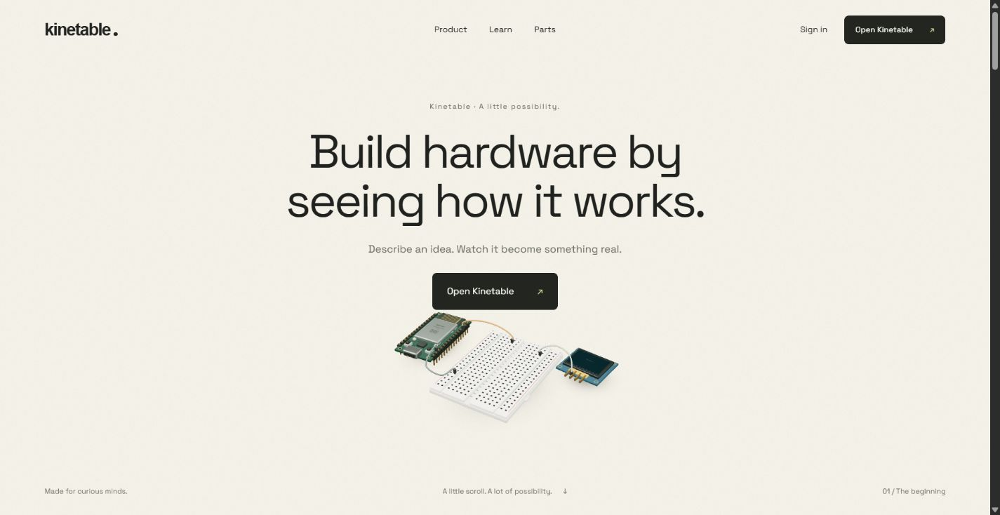

## 2. Board selection — attractive, but ownership assumed

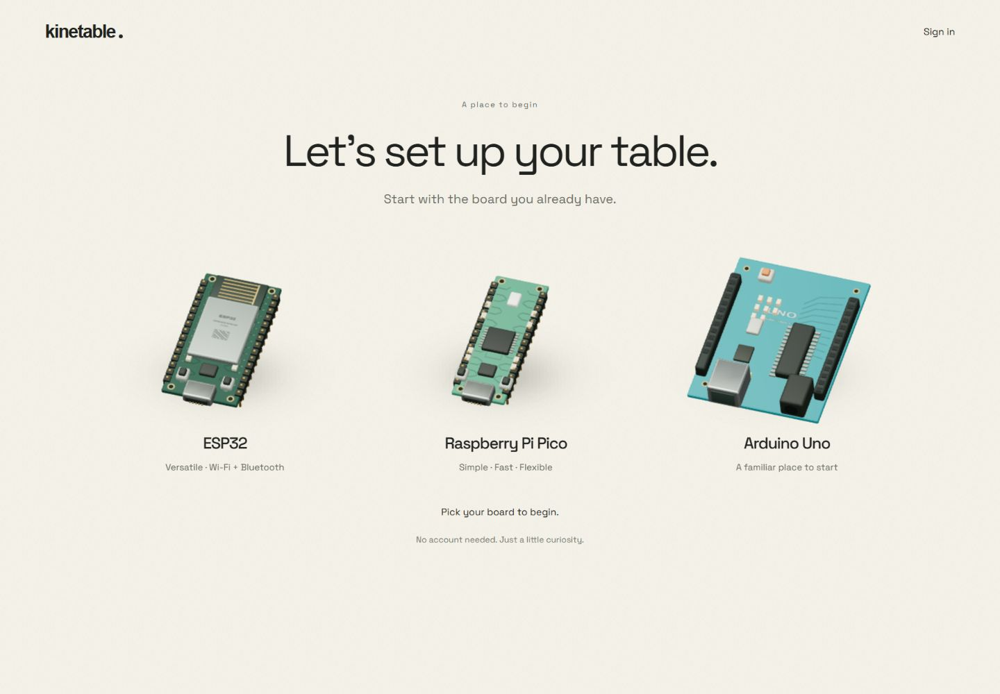

## 3. First workbench — competing next actions and “First table” project

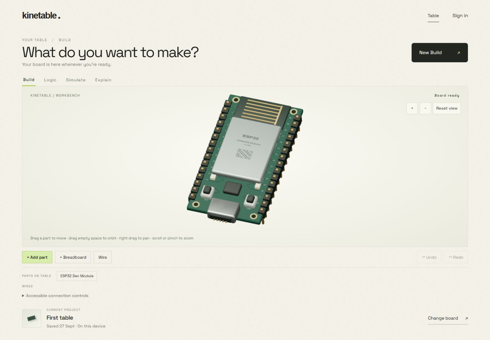

## 4. Create build — approachable intent, ambiguous preview

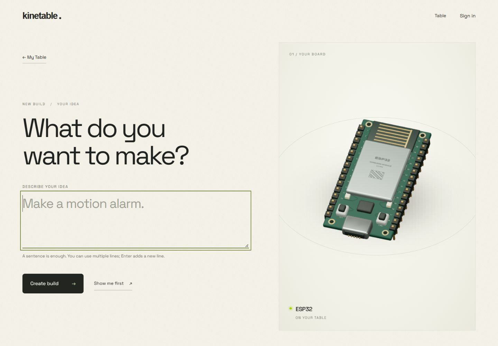

## 5. Add parts — contextual tray, technical catalog labels and provider blocker

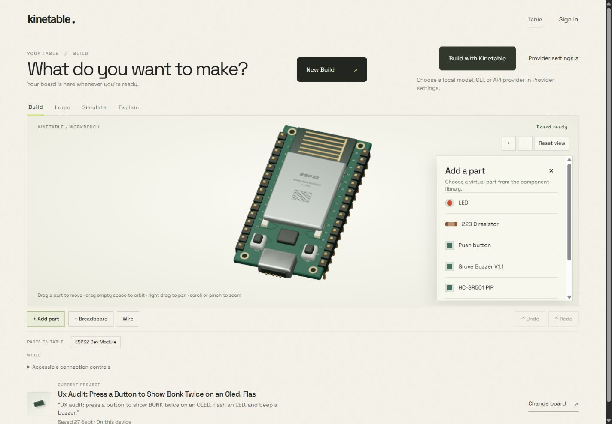

## 6. Wiring — direct supply/LED connection saved as an incomplete build

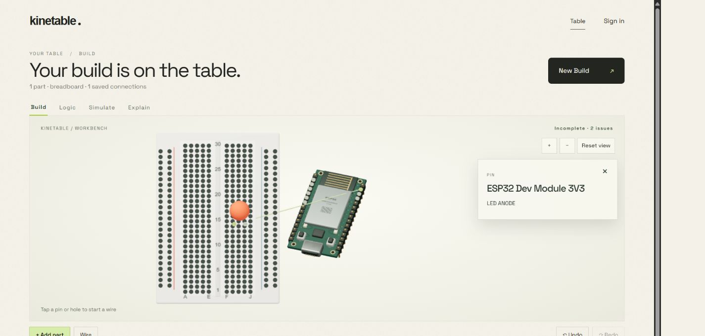

## 7. BONK Logic — IDs, repeated controls, occluded OLED and nested scrolling

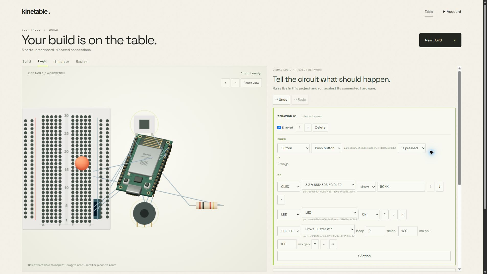

## 8. BONK running — verified LED ON and OLED BONK output

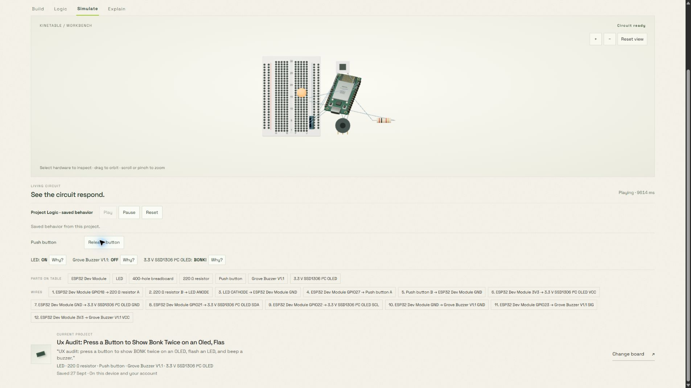

## 9. Explain — causal evidence with raw endpoint and rule IDs

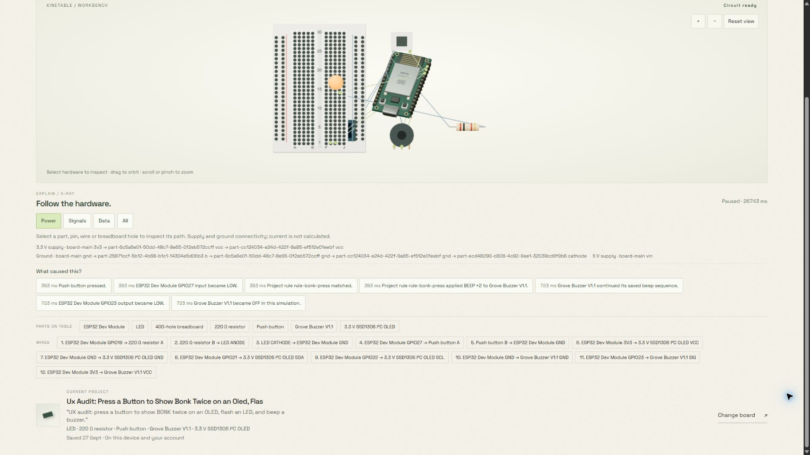

## 10. Invalid logic — generic command error after invalid beep count

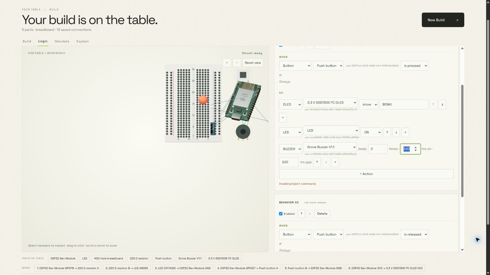

## 11. Account — prominent email, paragraph sync status and weak hierarchy

The account screenshot is retained locally and omitted from this public copy because it contains the signed-in email address.

## 12. Mobile — desktop lists consume the task flow

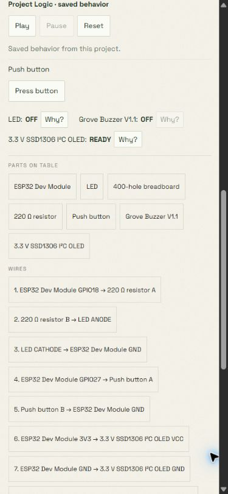
